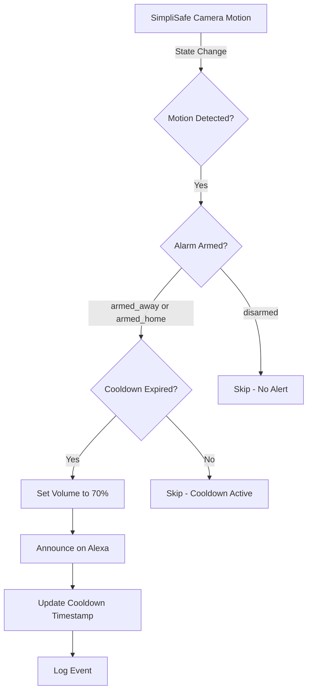

# Home Assistant - SimpliSafe Motion → Alexa Alert System

Production-grade Home Assistant configuration for Ubuntu server that triggers Alexa announcements when SimpliSafe motion cameras detect motion while the alarm is armed.

## Overview

This system provides event-driven security alerts by:
1. Monitoring SimpliSafe camera motion sensors
2. Checking if the alarm system is armed
3. Announcing alerts on configured Alexa devices via Nabu Casa Cloud
4. Implementing cooldown logic to prevent spam

**Architecture**: SimpliSafe API → Home Assistant → Nabu Casa Cloud → Alexa Devices

## Features

- ✅ Event-driven (no polling)
- ✅ Reliable for security alerts
- ✅ Clean YAML configuration
- ✅ Cooldown protection against rapid triggers
- ✅ Multiple Alexa device support
- ✅ Volume management
- ✅ Comprehensive error handling
- ✅ Production-ready automation

## Quick Start

### Prerequisites

- Ubuntu server (20.04+)
- Docker and Docker Compose installed
- SimpliSafe account
- Nabu Casa Cloud subscription ($6.50/month)

### Installation

1. **Clone repository**
   ```bash
   git clone https://github.com/ethanteng/home-assistant.git
   cd home-assistant
   ```

2. **Configure secrets**
   ```bash
   cp config/secrets.yaml.example config/secrets.yaml
   nano config/secrets.yaml  # Add your SimpliSafe credentials
   ```

3. **Start Home Assistant**
   ```bash
   docker-compose up -d
   ```

4. **Complete setup**
   - Open `http://your-server-ip:8123`
   - Complete initial setup wizard
   - Configure SimpliSafe integration
   - Configure Nabu Casa Cloud
   - Update `config/automations.yaml` with your entity IDs

See [docs/SETUP.md](./docs/SETUP.md) for detailed instructions.

## Project Structure

```
home-assistant/
├── docker-compose.yml          # Docker Compose configuration
├── config/                     # Home Assistant configuration
│   ├── configuration.yaml      # Main HA config
│   ├── automations.yaml        # Motion detection automation
│   ├── input_datetime.yaml     # Cooldown helper
│   └── secrets.yaml.example    # Secrets template
├── docs/                       # Documentation
│   ├── SETUP.md               # Installation guide
│   ├── ENTITY_DISCOVERY.md    # Finding entity IDs
│   ├── TESTING.md             # Testing procedures
│   └── TROUBLESHOOTING.md     # Common issues
└── README.md                   # This file
```

## Configuration

### Required Customizations

After initial setup, update `config/automations.yaml`:

1. **SimpliSafe motion sensors**: Replace placeholder entity IDs in `trigger.entity_id`
2. **Alarm control panel**: Update `condition.entity_id` with your alarm entity
3. **Alexa devices**: Update `action` service calls with your `media_player` entity IDs

See [docs/ENTITY_DISCOVERY.md](./docs/ENTITY_DISCOVERY.md) for finding entity IDs.

### Example Entity IDs

- Motion sensors: `binary_sensor.front_door_camera_motion`
- Alarm panel: `alarm_control_panel.simplisafe`
- Alexa devices: `media_player.kitchen_echo`

## Testing

Test the automation without waiting for real motion:

1. **Arm alarm**: Set alarm state to `armed_away` via Developer Tools
2. **Trigger motion**: Manually set motion sensor to `on`
3. **Verify**: Alexa should announce within seconds

See [docs/TESTING.md](./docs/TESTING.md) for comprehensive testing guide.

## Documentation

- **[Setup Guide](./docs/SETUP.md)** - Complete installation and configuration
- **[Entity Discovery](./docs/ENTITY_DISCOVERY.md)** - Finding SimpliSafe and Alexa entities
- **[Testing](./docs/TESTING.md)** - Testing procedures and manual triggers
- **[Troubleshooting](./docs/TROUBLESHOOTING.md)** - Common issues and solutions

## How It Works

### Automation Flow



### Key Components

1. **Trigger**: SimpliSafe camera motion sensors (`binary_sensor.*motion*`)
2. **Condition**: Alarm must be `armed_away` or `armed_home`
3. **Cooldown**: 30-second minimum between announcements
4. **Action**: Volume set → TTS announcement → Logging

## Maintenance

### Update Home Assistant

```bash
docker-compose pull
docker-compose up -d
```

### Backup Configuration

```bash
tar -czf backup-$(date +%Y%m%d).tar.gz config/
```

### View Logs

```bash
docker-compose logs -f homeassistant
```

## Requirements

- **Host**: Ubuntu server (headless)
- **Home Assistant**: Docker-based installation
- **Integrations**:
  - SimpliSafe (official integration)
  - Nabu Casa Cloud (for Alexa)
- **Services**:
  - SimpliSafe account with cameras
  - Nabu Casa Cloud subscription
  - Alexa devices (Echo, Dot, etc.)

## Security Notes

- Never commit `secrets.yaml` to git (already in `.gitignore`)
- Keep Home Assistant updated for security patches
- Use strong passwords for SimpliSafe and Amazon accounts
- Restrict firewall to necessary ports only

## Troubleshooting

Common issues:

- **Automation not triggering**: Check entity IDs, verify automation enabled
- **Alexa not announcing**: Verify Nabu Casa Cloud connection, test TTS service
- **Cooldown not working**: Check `input_datetime` helper exists

See [docs/TROUBLESHOOTING.md](./docs/TROUBLESHOOTING.md) for detailed solutions.

## License

MIT License - See LICENSE file for details

## Contributing

This is a personal project, but suggestions and improvements are welcome via issues or pull requests.

## Support

For issues specific to:
- **Home Assistant**: [Home Assistant Community](https://community.home-assistant.io/)
- **SimpliSafe Integration**: [HA SimpliSafe Docs](https://www.home-assistant.io/integrations/simplisafe/)
- **Nabu Casa Cloud**: [Nabu Casa Support](https://www.nabucasa.com/support/)
